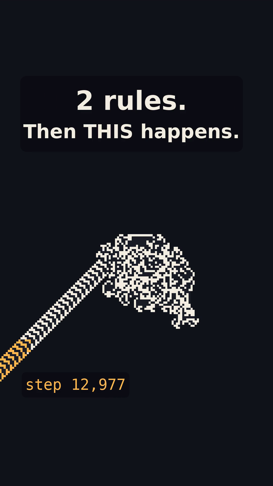

# Two Rules, One Road

**Langton's Ant and the Highway Conjecture: a computational investigation and a short film.**

<p align="center"></p>

Video: [`movie/langtons_ant.mp4`](movie/langtons_ant.mp4) (1080x1920 vertical, 79 s, H.264 + AAC, works muted).
Upload text: [`movie/DESCRIPTION.md`](movie/DESCRIPTION.md).
Full research write-up: [`research/FINDINGS.md`](research/FINDINGS.md).

## The mystery

An ant stands on an infinite grid of white cells and follows two rules:

* on a **white** cell: turn right, flip the cell to black, step forward;
* on a **black** cell: turn left, flip the cell to white, step forward.

Started on an empty grid it scribbles what looks like random noise for exactly **9,977 steps**,
then abruptly starts repeating a **104-step cycle** that carries it diagonally to infinity: the
"highway". Every finite starting pattern anyone has ever tried ends the same way.

* **Proven** (Bunimovich and Troubetzkoy, 1992): from any finite start the ant's path is unbounded.
  No finite pattern can trap it.
* **Proven** (Gajardo, Moreira and Goles, 2002): a single ant on a finite pattern can evaluate any
  boolean circuit, so predicting it is P-hard.
* **Open**: does *every* finite starting pattern eventually build the highway? Nobody has proved
  it or found a counterexample in forty years.

## What we established

All simulators are C (about 100 million steps per second), and every number below was re-derived
by an independent verifier who wrote their own simulator from [`research/CONVENTIONS.md`](research/CONVENTIONS.md).
A highway is only counted when its 104-periodicity holds for 20 full periods **and** the ant has
escaped, by 20 cells in its direction of travel, the bounding box of every cell it touched before
the highway began (plus the initial black cells). The 1x1 to 5x5 enumeration was additionally
re-run with a stricter certificate that is sufficient for the highway to continue forever (see
`research/exhaustive/README.md`, "Strict certificate"): every pattern passed and the onset
histograms were identical.

| Experiment | Runs | Highways | Longest delay before the highway |
|---|---:|---:|---:|
| Every pattern in a 1x1, 2x2, 3x3, 4x4 and 5x5 box | 33,620,498 | 33,620,498 | 233,232 steps (11 cells, provably the 5x5 maximum) |
| Random boxes, 5x5 up to 512x512, densities 0.05 to 0.95 (draws; at most ~4.49 million distinct patterns) | 4,730,000 | 4,730,000 | 1,323,594 steps (512x512 box, 130,511 black cells) |
| Adversarial: evolutionary search, 202 structured seeds, 1,512 walls placed on or beside the road (616 in its path) | 3,484,889 | 3,484,889 | 259,274 steps (four 2x2 walls, 16 cells) |
| **Total** | **41,835,387** | **41,835,387** | **0 exceptions** |

Runs, not distinct patterns: the random draws repeat in small boxes and the evolutionary search
re-evaluated some genomes, so the number of distinct starting patterns is smaller (about 41.0
million). Of the adversarial runs, 21,861 are regenerated by the committed scripts; the
3,463,028 evaluations of the two wall-clock-limited extended searches are archived as complete
logs in `research/adversarial/evidence/` and can be recounted and spot-checked by re-simulation.

Other facts the film uses, all verified:

* Empty grid: onset step 9,977; the highway moves (-2, -2) cells per 104 steps; each cycle has
  58 right and 46 left turns and leaves 12 black cells behind.
* The chaos blob before the highway touches 1,376 cells (715 black) inside a 49x45 box.
* A 5x5 pattern exists that is on the highway after only **32 steps**; the most common onset
  among all 33,554,432 patterns in that box is step 266.
* 67.4 % of the 400,000 main-sweep random boxes reach the highway *sooner* than the empty grid
  (66.4 % over all 4.73 million draws).
* Median onset in a random box grows only about like k^1.14 with the box side k (fit over k = 64
  to 512 at density 0.5), far slower than the diffusive k^2 one might guess. This is a finite-range
  fit, not an asymptotic law.
* Every one of the 616 walls that actually hit the highway caused a new highway to form.

This is evidence, not proof: finite enumeration cannot settle a statement about infinitely many
patterns. See [`research/FINDINGS.md`](research/FINDINGS.md) section 4 for the limits.

## Repository layout

```
research/
  CONVENTIONS.md      shared definitions (coordinates, step counting, onset, certification)
  FINDINGS.md         synthesis of all results with citations and reproduction commands
  onset/              exact onset from the empty grid (C + Python cross-check)
  exhaustive/         every pattern in boxes up to 5x5
  random/             random sweeps up to 512x512
  adversarial/        obstacles, evolutionary search, structured seeds, chained walls
  literature/         sources and what is actually proven (SOURCES.md)
  verify/             independent re-implementations by the verifier agents
  results/            machine-readable results; movie_facts.json holds the film's headline numbers
                      (the histogram comes from exhaustive.json; the six mosaic patterns and the
                      wall example are fixed records the renderer re-simulates and asserts)
movie/
  STORYBOARD.md       the spec the film was built from
  core.py, common.py  simulation, camera, text, charts, ffmpeg, audio primitives
  scenes_road.py      hook, rules, chaos, freeze, road, infinity, call to action
  scenes_evidence.py  mystery, mosaic, dot wall, stubbornest start, walls, verdict, scorecard
  audio.py            sonification: the ant's own turn sequence read as a waveform
  render.py           frame loop and CLI
  langtons_ant.mp4    the film
```

## Reproduce

Research (see `research/FINDINGS.md` section 6 for one command per result):

```
cd research/onset && make all                 # onset 9977 and the highway geometry, seconds
sh research/exhaustive/run_all.sh             # every 1x1..5x5 pattern, ~17 min on 2 cores
sh research/random/run_all.sh                 # 400,000-box main sweep
sh research/adversarial/run_all.sh            # obstacles, structured seeds, the two main GA runs
python3 research/adversarial/count_evidence.py  # recount + spot-check the archived extended GA logs
sh research/exhaustive/run_strict.sh          # strict-certificate pass over every 1x1..5x5 pattern
```

Film (Python 3.11, `pip install numpy pillow imageio-ffmpeg`; the DejaVu Sans and Mono TTF fonts
are searched in the usual font directories, or set `LANGTON_FONT_DIR` to a directory holding them):

```
cd movie && export PYTHONPATH=$PWD
python3 render.py --facts ../research/results/movie_facts.json \
    --out build/silent.mp4 --timeline build/timeline.json
python3 audio.py --timeline build/timeline.json --wav build/mix.wav \
    --mux build/silent.mp4 --out langtons_ant.mp4
```

The renderer aborts if any number it is asked to show is missing from `movie_facts.json` or if
its own re-simulation disagrees with the recorded onset steps.

## How this was made

Everything here was produced by Claude (an AI) in one session, using multi-agent workflows:
five research agents each attacked the problem from a different angle, skeptical verifier
agents re-implemented every simulator from the conventions file and re-derived every claim, a
synthesis agent wrote the findings, a panel of three storyboard proposals was scored by three
judges, engineers built the renderer from the winning storyboard, and reviewers checked the
film frame by frame for legibility, timing and scientific honesty before each fix round. An
adversarial review posted on the pull request then found three real errors (the random draws were
called distinct, the extended adversarial logs were not committed, and the renderer's
completeness gate did not check the sweep size); all are corrected in this version.

## Sound

The film's soundtrack is the ant. The sequence of right and left turns is read as a waveform at
22,880 turns per second, so chaos sounds like crackle and the 104-step highway becomes a steady
220 Hz tone. When the road forms, you can hear it.
